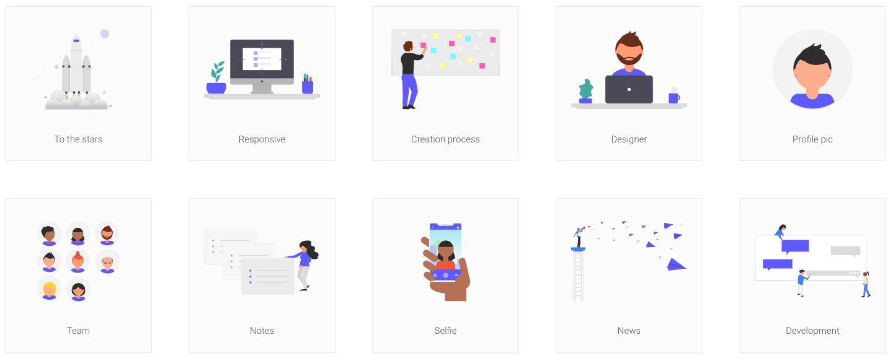

## React unDraw Components

#### MIT licensed illustrations by unDraw for your React projects

* SVGs from [unDraw](https://undraw.co/) as customisable images in React.  
* It's an early version, only containing 10 illustrations, adding more as I get time - contributors welcome!
* available to try on [npm](https://www.npmjs.com/package/react-undraw-illustrations)
* play with it in [styleguidist](https://graemefulton.github.io)

## Project Usage
Install in your project: `npm install react-undraw-illustrations --save`

At the top of your React component, import the illustrations you want to use:

`import {UndrawTabs, UndrawDesigner,UndrawResponsive } from 'react-undraw-illustrations';`

Then use them, passing settings you like, e.g:

`<UndrawDesigner skinColor="brown" hairColor="#222"/>`

#### Check out how the components work:

