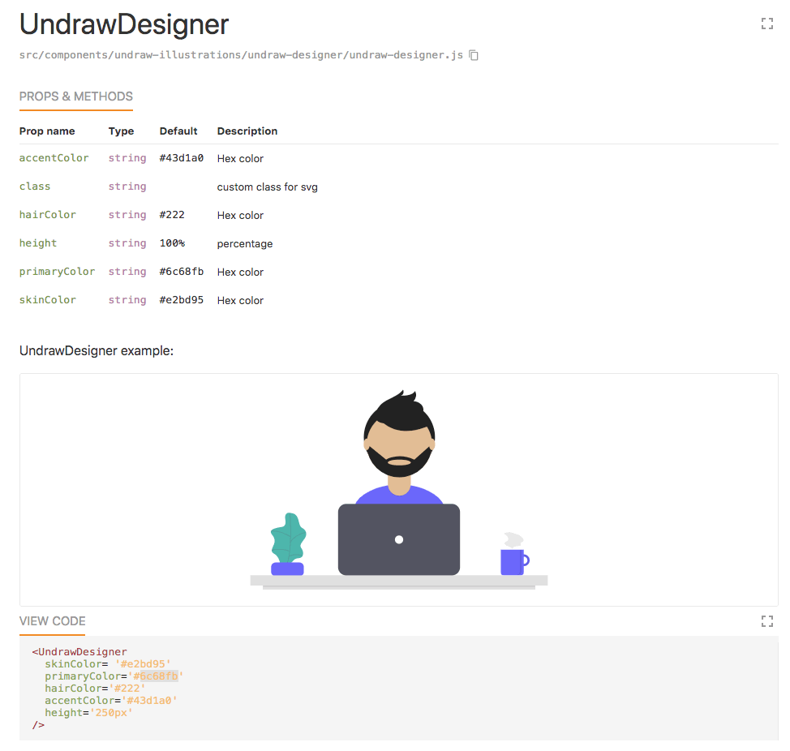

## React unDraw Components

#### MIT licensed illustrations by unDraw for your React projects

* SVGs from [unDraw](https://undraw.co/) as customisable images in React.  
* It's an early version, only containing 10 illustrations, adding more as I get time - contributors welcome! *update - now 21!
* available to try on [npm](https://www.npmjs.com/package/react-undraw-illustrations)
* play with it in [styleguidist](https://graemefulton.github.io)

## Contributors

Big thanks to [Lena](https://twitter.com/venablena) for converting the extra 330 illustrations!! (I only made 20) 

## Project Usage
Install in your project: `npm install react-undraw-illustrations --save`

At the top of your React component, import the illustrations you want to use:

`import {UndrawTabs, UndrawDesigner,UndrawResponsive } from 'react-undraw-illustrations';`

Then use them, passing settings you like, e.g:

`<UndrawDesigner skinColor="brown" hairColor="#222"/>`

#### Check out how the components work:

#### Find out more about how this was made:

Read about it on CSS-Tricks 👉 [How to Create a Component Library From SVG Illustrations](https://css-tricks.com/how-to-create-a-component-library-from-svg-illustrations/)

---

# Preparing the NPM package

I followed this guide to prepare the NPM package: https://medium.com/@lokhmakov/best-way-to-create-npm-packages-with-create-react-app-b24dd449c354

When running `yarn run lib`, it's supposed to copy the components from `/src/node_modeules/components` to `/lib/components/`.

Also, you need to **make sure** any new components are also present in `/src/node_modules/index.js`, and run `yarn run lib`!

I did this with this [spreadsheet](https://docs.google.com/spreadsheets/d/1RFosgYpt4JHZgg7JMnISlz8c9Q8CxrGVubJC6VKnZQY/edit?usp=sharing) haha!
